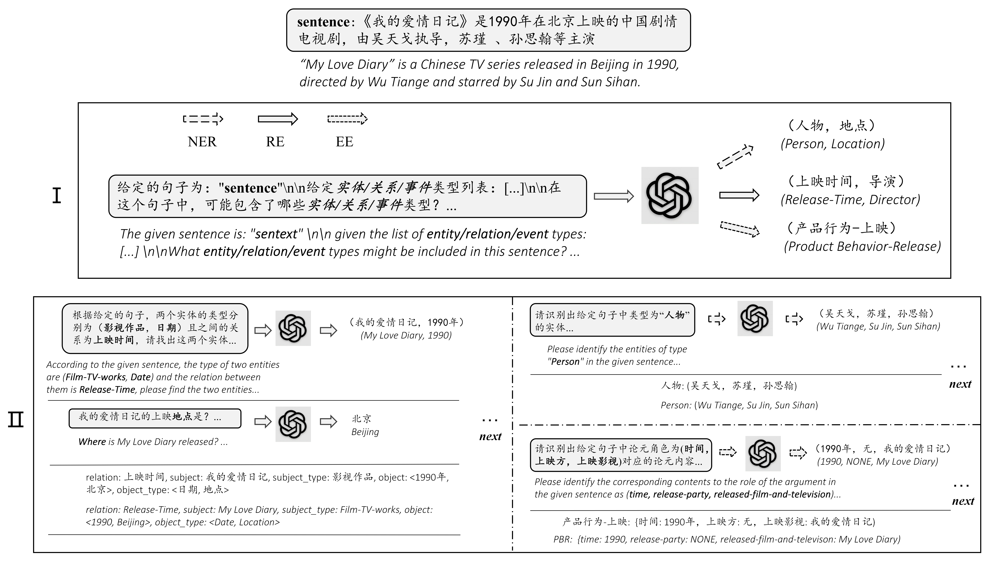
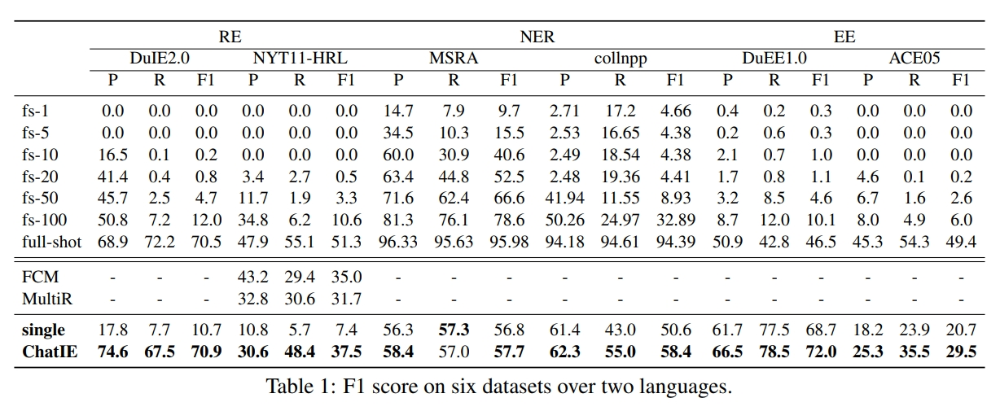
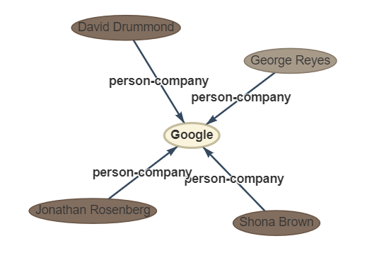
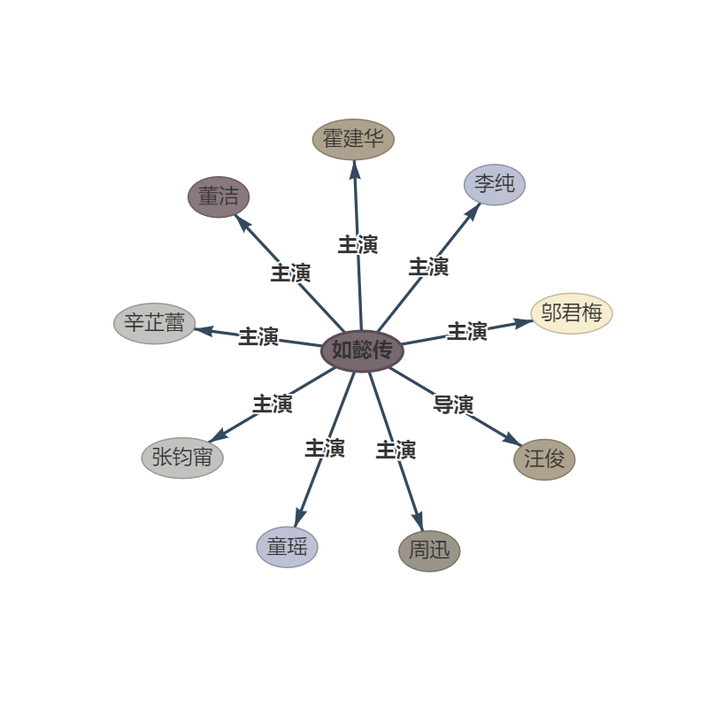
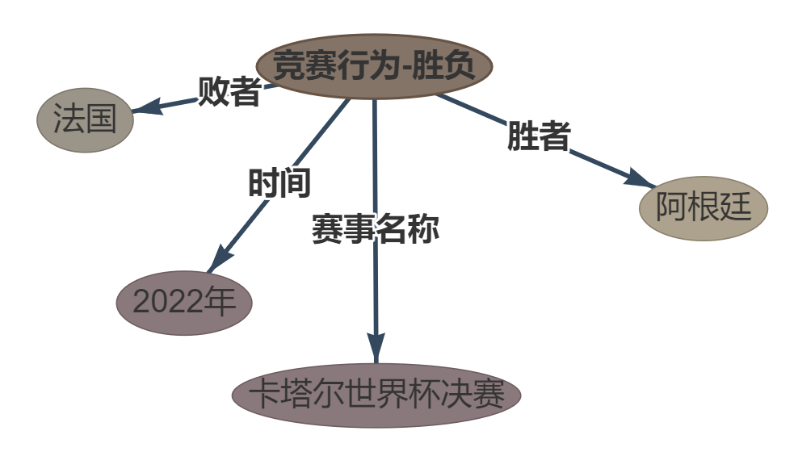
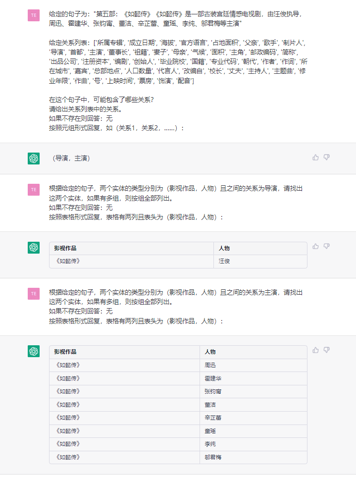
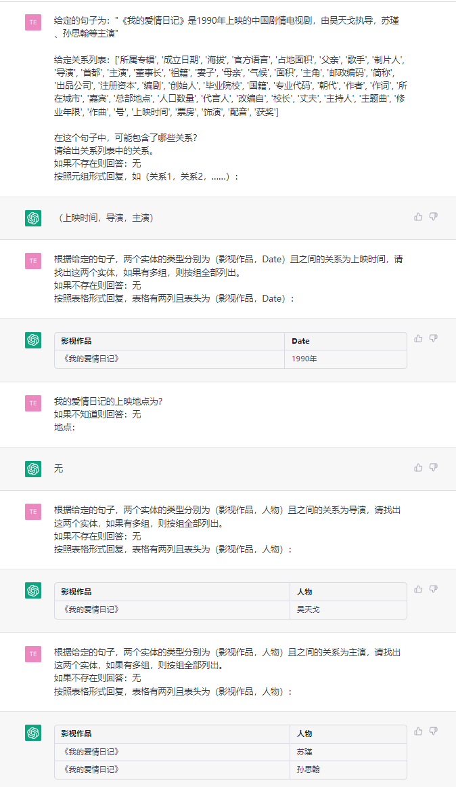

# ChatIE🐬

 


Official repository of paper ["Zero-Shot Information Extraction via Chatting with ChatGPT"](https://arxiv.org/pdf/2302.10205.pdf). Please star, watch, and fork our repo for the active updates!  

## Abstract
Zero-shot information extraction (IE) aims to
build IE systems from the unannotated text.
It is challenging due to involving little human intervention. Challenging but worthwhile, zero-shot IE reduces the time and effort that data labeling takes. Recent efforts
on large language models (LLMs, e.g., GPT3, ChatGPT) show promising performance on
zero-shot settings, thus inspiring us to explore prompt-based methods. In this work,
we ask whether strong IE models can be constructed by directly prompting LLMs. Specifically, we transform the zero-shot IE task
into a multi-turn question-answering problem
with a two-stage framework (ChatIE). With
the power of ChatGPT, we extensively evaluate our framework on three IE tasks: entityrelation triple extract, named entity recognition, and event extraction. Empirical results
on six datasets across two languages show that
ChatIE achieves impressive performance and
even surpasses some full-shot models on several datasets (e.g., NYT11-HRL). We believe
that our work could shed light on building IE
models with limited resources.

零样本信息抽取（Information Extraction，IE）旨在从无标注文本中建立IE系统，因为很少涉及人为干预，该问题非常具有挑战性。但零样本IE不再需要标注数据时耗费的时间和人力，因此十分重要。近来的大规模语言模型（例如GPT-3，Chat GPT）在零样本设置下取得了很好的表现，这启发我们探索基于提示的方法来解决零样本IE任务。我们提出一个问题：不经过训练来实现零样本信息抽取是否可行？我们将零样本IE任务转变为一个两阶段框架的多轮问答问题（Chat IE）,并在三个IE任务中广泛评估了该框架：实体关系三元组抽取、命名实体识别和事件抽取。在两个语言的6个数据集上的实验结果表明，Chat IE取得了非常好的效果，甚至在几个数据集上（例如NYT11-HRL）上超过了全监督模型的表现。我们的工作能够为有限资源下IE系统的建立奠定基础。

## Methods


## Results


## Tools🧰 
**UPDATE：** **we use the official api, the tool becomes more faster!!! if the key exceed limits please tell us.**  

**NOTICE：** **The response speed depends on the official openai chatgpt api. (sometimes, the official is too crowded and the speed will be slow or the chatgpt will be overloaded.)** Moreover, you better use your own openai key because if our default account is used by multiple people at the same time, the account may be overloaded.  

~~**NOTICE:** because official api is not available in domestic, so we use api from [revChatGPT](https://github.com/acheong08/ChatGPT) and v1 version. But it's **too slow**, so we advise you use the tool offline for study. We will update the api further in the future (**TODO**).~~   

we also provide a IE tool based on GPT3.5, you can see in [GPT4IE](https://github.com/cocacola-lab/GPT4IE)
### Description
ChatIE (Zero-Shot Information Extraction via Chatting with ChatGPT) is a open-source and powerful IE tool [demo](http://124.221.16.143:5000/). Enhanced by ChatGPT and prompting, it aims to automatically extract **structured information** from a **raw sentence** and make a valuable in-depth analysis of the input sentence. Harnessing valuable structured information helps corporations make incisive and business–improving decisions.  


We support the following functions:
| Task | Name| Lauguages |
|---| ---| --- |
| RE | entity-relation joint extraction | Chinese, English|
|NER |named entity recoginzation | Chinese, English|
|EE| event extraction | Chinese, English|

#### RE
This task aims to extract triples from plain texts, such as **(China, capital, Beijing)** , **(《如懿传》, 主演, 周迅)**.
##### Input
- sentence: a plain text.
- relation type list (rtl)* : {'relation type 1': ['subject1', 'object1'], 'relation type 2': ['subject2', 'object2'], ...}

PS: * denote optional, we set default value for them. But for better extraction, you should specify the three list according to application scenarios.
##### Examples
**sentence:** Four other Google executives the chief financial officer , George Reyes ; the senior vice president for business operations , Shona Brown ; the chief legal officer , David Drummond ; and the senior vice president for product management , Jonathan Rosenberg earned salaries of $ 250,000 each .  
**rtl:** default, see file "default-types"  
**ouptut:**  
  

**sentence:** 第五部：《如懿传》《如懿传》是一部古装宫廷情感电视剧，由汪俊执导，周迅、霍建华、张钧甯、董洁、辛芷蕾、童瑶、李纯、邬君梅等主演。  
**rtl:** default, see file "default-types"  
**ouptut:**  
 

---
#### NER
This task aims to extract entities from plain texts, such as **(LOC, Beijing)** , **(人物, 周恩来)**.
##### Input
- sentence: a plain text.
- entity type list (etl)* : ['entity type 1', 'entity type 2', ...]  

##### Examples
**sentence:** James worked for Google in Beijing, the capital of China. 
**etl:**  ['LOC', 'MISC', 'ORG', 'PER']  
**ouptut:**  
  

**sentence:** 中国共产党创立于中华民国大陆时期，由陈独秀和李大钊领导组织。   
**etl:** ['组织机构', '地点', '人物']  
**ouptut:**  
 

---
#### EE
This task aims to extract event from plain texts, such as **{Life-Divorce: {Person: Bob, Time: today, Place: America}}** , **{竞赛行为-晋级: {时间: 无, 晋级方: 西北狼, 晋级赛事: 中甲榜首之争}}**.
##### Input
- sentence: a plain text.
- event type list (etl)* : {'event type 1': ['argument role 1', 'argument role 2', ...], ...}  

**sentence:** Yesterday Bob and his wife got divorced in Guangzhou.  
**etl:**  default, see file "default-types"     
**ouptut:**  
  

**sentence:** 在2022年卡塔尔世界杯决赛中，阿根廷以点球大战险胜法国。  
**etl:** default, see file "default-types"  
**ouptut:**  
 

---

### Setup
react+flask  
1. cd `front-end` and Run `npm install` to download required dependencies.  
2. Run `npm run start`. ChatIE should open up in a new browser tab.  
3. cd `back-end` and Run `python run.py`.  
4. note: node-version v14.17.4  npm-version 9.6.0  


## Examples
### RE



### NER


### EE


---
### Citation

Checkout this paper [arxiv: 2302.10205](https://arxiv.org/pdf/2302.10205.pdf)

```
@article{wei2023zero,
  title={Zero-Shot Information Extraction via Chatting with ChatGPT},
  author={Wei, Xiang and Cui, Xingyu and Cheng, Ning and Wang, Xiaobin and Zhang, Xin and Huang, Shen and Xie, Pengjun and Xu, Jinan and Chen, Yufeng and Zhang, Meishan and others},
  journal={arXiv preprint arXiv:2302.10205},
  year={2023}
}
```
